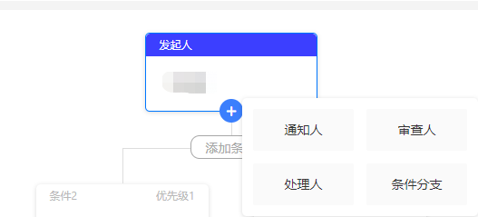

# vue-diagram-tree

# 前言

> > 最近公司项目（Vue）需求有用到 tree ，所以呢我去网上找了很多插件，都不是很符合我的要求。
> > 自己也根据业务需求重新做了一个插件，打包上传到了 npm，若有不妥之处请敬请指出！！

## 插件安装

```
npm install vue-diagram-tree -S
```

## 插件使用

### 基本使用

```
<diagram-tree
  @clickNode="clickNode"
></diagram-tree>
```

#### 引入组件

```
methods: {
  clickNode(data) {
    console.log(data);
  },
}
```

#### clickNode 点击节点

### 传入数据

```
<diagram-tree
  :data="data"
  :Ddrawer="Ddrawer"
  @changeNode="changeNode"
  @clickNode="clickNode"
>
  <div>条件</div>
</diagram-tree>
```

#### 引入组件

#### Ddrawer 遮罩内容

```
data = {
  id: "1",
  type: "sponsor",
  sponsor: ["pafu"],
  children: [],
}
```

#### 树状结构数据

|   属性   | 简介                                                                                                            |
| :------: | :-------------------------------------------------------------------------------------------------------------- |
|    id    | 作为标记节点的唯一 id，以树状结构书写 { id: "1" , children : [ {id: "11"]},{id: "12",children: [{id: "121"}} ]} |
|   type   | 对应流程配置项 name                                                                                             |
|  \$name  | 属性名对应流程配置项 name，用于显示的内容                                                                       |
| setting  | 配置项属性设置                                                                                                  |
| children | 子节点                                                                                                          |

```
methods: {
  clickNode(data) {
    console.log(data);
  },
  changeNode(data) {
    this.data = data;
  },
},
```

#### changeNode 节点数据发生变化

### 配置添加流程项（可添加的流程）



```
<diagram-tree
  :data="data"
  :options="options"
  @changeNode="changeNode"
  @clickNode="clickNode"
></diagram-tree>
```

#### 引入组件

```
data = {
  id: "1",
  type: "sponsor",
  sponsor: ["pafu"],
  children: [
    {
      id: "11",
      type: "notifier",
      notifier: ["pafu"],
      setting: [],
      children: [
        {
          id: "111",
          type: "examiner",
          examiner: ["pafu"],
        }
      ]
    }
  ],
}
```

#### 树状结构数据

```
options : [
  {
    name: "notifier",
    title: "通知人",
    color: "#6fe44c",
    default: {
      type: "notifier",
      notifier: [],
    },
  },
  {
    name: "examiner",
    title: "审查人",
    color: "#f3b645",
    default: {
      type: "examiner",
      examiner: [],
    },
  },
  {
    name: "handler",
    title: "处理人",
    color: "#e9ec2a",
    default: {
      type: "handler",
      handler: [],
    },
  },
];
```

#### 流程项配置

|  属性   | 简介         |
| :-----: | :----------- |
|  name   | 唯一名       |
|  title  | 标题名       |
|  color  | 标题背景颜色 |
| default | 默认值       |

#### default

|   属性   | 简介                                      |
| :------: | :---------------------------------------- |
|   type   | 对应流程配置项 name                       |
|  \$name  | 属性名对应流程配置项 name，用于显示的内容 |
| children | 子节点                                    |

```
methods: {
  clickNode(data) {
    console.log(data);
  },
  changeNode(data) {
    this.data = data;
  },
},
```

### 自定义其他流程（仅展示）

```
<diagram-tree
  :data="data"
  :others="others"
  @changeNode="changeNode"
  @clickNode="clickNode"
></diagram-tree>
```

#### 引入组件

```
data = {
  id: "1",
  type: "pafu",
  pafu: ["pafu"],
  children: [],
}
```

#### 树状结构数据

```
others : [
  {
    name: "pafu",
    title: "作者",
    color: "#000",
    default: {
      type: "pafu",
      pafu: [],
    },
  },
];
```

#### 其他流程项配置（属性与 option 一样）

```
methods: {
  clickNode(data) {
    console.log(data);
  },
  changeNode(data) {
    this.data = data;
  },
},
```

### 自定义条件分支节点属性配置

```
<diagram-tree
  :factor="factor"
  @clickNode="clickNode"
></diagram-tree>
```

#### 引入组件

```
factor: [
  {
    title: "选择任务",
    value: "2",
    ...
  },
  {
    title: "简介",
    value: "",
    ...
  },
]
```

#### 条件分支节点属性配置（对应 setting 设置属性）

```
methods: {
  clickNode(data) {
    console.log(data);
  },
}
```

#### clickNode 点击节点

#### 最后附上 Git 地址：https://github.com/LairPaFu/vue-diagram-tree
